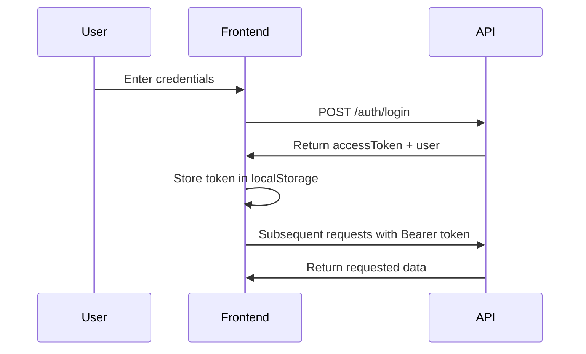
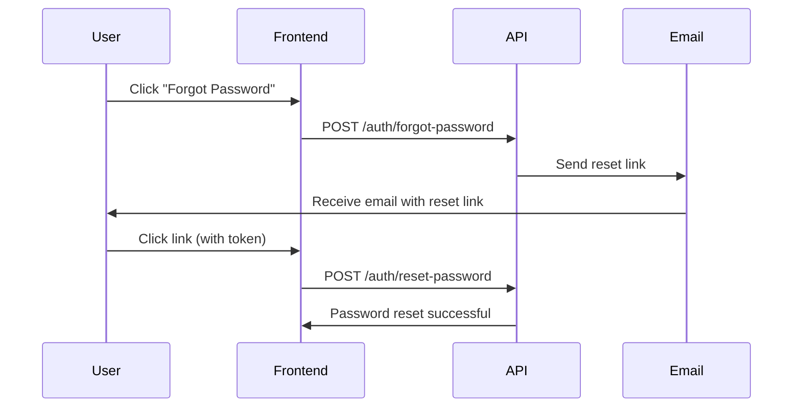

# Frontend Integration Guide - Authentication API

## Overview

This guide provides comprehensive instructions for frontend developers to integrate with the Authentication API. The API uses Laravel Sanctum for token-based authentication and follows RESTful principles.

**Base URL:** `http://localhost:8080/api` (Development)
**Authentication:** Bearer Token (Sanctum)
**Content-Type:** `application/json`

---

## Table of Contents

1. [Quick Start](#quick-start)
2. [Authentication Flow](#authentication-flow)
3. [API Endpoints](#api-endpoints)
4. [Error Handling](#error-handling)
5. [Code Examples](#code-examples)
6. [Best Practices](#best-practices)
7. [Troubleshooting](#troubleshooting)

---

## Quick Start

### Prerequisites

- API server running at `http://localhost:8080`
- User account (created by administrator)
- HTTP client library (axios, fetch, etc.)

### Installation (Example with Axios)

```bash
npm install axios
```

### Basic Setup

```javascript
import axios from 'axios';

const api = axios.create({
  baseURL: 'http://localhost:8080/api',
  headers: {
    'Content-Type': 'application/json',
    'Accept': 'application/json',
  },
});

// Add token to requests if available
api.interceptors.request.use((config) => {
  const token = localStorage.getItem('accessToken');
  if (token) {
    config.headers.Authorization = `Bearer ${token}`;
  }
  return config;
});

export default api;
```

---

## Authentication Flow

### Standard Login Flow



### Password Reset Flow



---

## API Endpoints

### 1. Login

Authenticate a user and receive an access token.

**Endpoint:** `POST /api/auth/login`
**Rate Limit:** 6 requests per minute
**Authentication:** Not required

**Request:**
```json
{
  "email": "john.doe@example.com",
  "password": "SecureP@ssw0rd",
  "rememberMe": false
}
```

**Response (200 OK):**
```json
{
  "user": {
    "id": "550e8400-e29b-41d4-a716-446655440000",
    "email": "john.doe@example.com",
    "emailVerified": true,
    "firstName": "John",
    "lastName": "Doe",
    "username": "johndoe",
    "avatarUrl": "https://example.com/avatars/johndoe.jpg",
    "timezone": "America/New_York",
    "role": "user",
    "createdAt": "2025-01-15T10:30:00Z",
    "updatedAt": "2025-01-15T10:30:00Z",
    "lastLoginAt": "2025-01-15T10:30:00Z"
  },
  "accessToken": "1|abcdef123456...",
  "tokenType": "Bearer",
  "expiresIn": 3600
}
```

**Error Response (401 Unauthorized):**
```json
{
  "error": "UNAUTHORIZED",
  "message": "Invalid credentials",
  "statusCode": 401,
  "timestamp": "2025-01-15T10:30:00Z"
}
```

---

### 2. Get Current User

Retrieve the authenticated user's profile.

**Endpoint:** `GET /api/auth/me`
**Authentication:** Required (Bearer token)

**Request Headers:**
```
Authorization: Bearer <your-access-token>
```

**Response (200 OK):**
```json
{
  "id": "550e8400-e29b-41d4-a716-446655440000",
  "email": "john.doe@example.com",
  "emailVerified": true,
  "firstName": "John",
  "lastName": "Doe",
  "username": "johndoe",
  "avatarUrl": "https://example.com/avatars/johndoe.jpg",
  "timezone": "America/New_York",
  "role": "user",
  "createdAt": "2025-01-15T10:30:00Z",
  "updatedAt": "2025-01-15T10:30:00Z",
  "lastLoginAt": "2025-01-15T10:30:00Z"
}
```

---

### 3. Logout

Invalidate the current access token.

**Endpoint:** `POST /api/auth/logout`
**Authentication:** Required (Bearer token)

**Request Headers:**
```
Authorization: Bearer <your-access-token>
```

**Response (200 OK):**
```json
{
  "message": "Logout successful"
}
```

---

### 4. Forgot Password

Request a password reset email.

**Endpoint:** `POST /api/auth/forgot-password`
**Rate Limit:** 6 requests per minute
**Authentication:** Not required

**Request:**
```json
{
  "email": "john.doe@example.com"
}
```

**Response (200 OK):**
```json
{
  "message": "If an account exists with this email, a password reset link has been sent"
}
```

**Note:** For security reasons, the API always returns success even if the email doesn't exist.

---

### 5. Reset Password

Reset password using the token from email.

**Endpoint:** `POST /api/auth/reset-password`
**Rate Limit:** 6 requests per minute
**Authentication:** Not required

**Request:**
```json
{
  "email": "john.doe@example.com",
  "token": "abc123def456ghi789",
  "newPassword": "NewSecureP@ssw0rd"
}
```

**Password Requirements:**
- Minimum 8 characters
- Maximum 128 characters
- At least one uppercase letter
- At least one lowercase letter
- At least one number
- At least one special character

**Response (200 OK):**
```json
{
  "message": "Password has been reset successfully"
}
```

**Error Response (401 Unauthorized):**
```json
{
  "error": "UNAUTHORIZED",
  "message": "Invalid or expired reset token",
  "statusCode": 401,
  "timestamp": "2025-01-15T10:30:00Z"
}
```

**Validation Error (422):**
```json
{
  "error": "VALIDATION_ERROR",
  "message": "Validation failed",
  "statusCode": 422,
  "errors": [
    {
      "field": "password",
      "message": "Password must contain at least one uppercase letter",
      "code": "PASSWORD_UPPERCASE_REQUIRED"
    }
  ],
  "timestamp": "2025-01-15T10:30:00Z"
}
```

---

## Error Handling

### Standard Error Response Format

```json
{
  "error": "ERROR_CODE",
  "message": "Human-readable error message",
  "statusCode": 400,
  "timestamp": "2025-01-15T10:30:00Z"
}
```

### HTTP Status Codes

| Code | Meaning | When it occurs |
|------|---------|----------------|
| 200 | OK | Request successful |
| 400 | Bad Request | Invalid input data |
| 401 | Unauthorized | Invalid credentials or missing/expired token |
| 422 | Validation Error | Input validation failed |
| 429 | Too Many Requests | Rate limit exceeded |
| 500 | Internal Server Error | Server error |

### Error Codes

| Code | Description |
|------|-------------|
| `UNAUTHORIZED` | Invalid credentials or token |
| `VALIDATION_ERROR` | Request validation failed |
| `RATE_LIMIT_EXCEEDED` | Too many requests |

---

## Code Examples

### React Example (with Hooks)

```javascript
import { useState } from 'react';
import api from './api';

function LoginForm() {
  const [email, setEmail] = useState('');
  const [password, setPassword] = useState('');
  const [error, setError] = useState(null);
  const [loading, setLoading] = useState(false);

  const handleLogin = async (e) => {
    e.preventDefault();
    setLoading(true);
    setError(null);

    try {
      const response = await api.post('/auth/login', {
        email,
        password,
        rememberMe: false,
      });

      // Store token
      localStorage.setItem('accessToken', response.data.accessToken);
      localStorage.setItem('user', JSON.stringify(response.data.user));

      // Calculate expiration time
      const expiresAt = Date.now() + (response.data.expiresIn * 1000);
      localStorage.setItem('tokenExpiresAt', expiresAt);

      // Redirect or update state
      window.location.href = '/dashboard';
    } catch (err) {
      if (err.response?.status === 401) {
        setError('Invalid email or password');
      } else if (err.response?.status === 429) {
        setError('Too many login attempts. Please try again later.');
      } else {
        setError('An error occurred. Please try again.');
      }
    } finally {
      setLoading(false);
    }
  };

  return (
    <form onSubmit={handleLogin}>
      {error && <div className="error">{error}</div>}

      <input
        type="email"
        value={email}
        onChange={(e) => setEmail(e.target.value)}
        placeholder="Email"
        required
      />

      <input
        type="password"
        value={password}
        onChange={(e) => setPassword(e.target.value)}
        placeholder="Password"
        required
      />

      <button type="submit" disabled={loading}>
        {loading ? 'Logging in...' : 'Login'}
      </button>
    </form>
  );
}

export default LoginForm;
```

### Vue.js Example

```javascript
<template>
  <form @submit.prevent="handleLogin">
    <div v-if="error" class="error">{{ error }}</div>

    <input
      v-model="email"
      type="email"
      placeholder="Email"
      required
    />

    <input
      v-model="password"
      type="password"
      placeholder="Password"
      required
    />

    <button type="submit" :disabled="loading">
      {{ loading ? 'Logging in...' : 'Login' }}
    </button>
  </form>
</template>

<script>
import api from './api';

export default {
  data() {
    return {
      email: '',
      password: '',
      error: null,
      loading: false,
    };
  },
  methods: {
    async handleLogin() {
      this.loading = true;
      this.error = null;

      try {
        const response = await api.post('/auth/login', {
          email: this.email,
          password: this.password,
          rememberMe: false,
        });

        localStorage.setItem('accessToken', response.data.accessToken);
        localStorage.setItem('user', JSON.stringify(response.data.user));

        const expiresAt = Date.now() + (response.data.expiresIn * 1000);
        localStorage.setItem('tokenExpiresAt', expiresAt);

        this.$router.push('/dashboard');
      } catch (err) {
        if (err.response?.status === 401) {
          this.error = 'Invalid email or password';
        } else if (err.response?.status === 429) {
          this.error = 'Too many login attempts. Please try again later.';
        } else {
          this.error = 'An error occurred. Please try again.';
        }
      } finally {
        this.loading = false;
      }
    },
  },
};
</script>
```

### Password Reset Example

```javascript
async function requestPasswordReset(email) {
  try {
    await api.post('/auth/forgot-password', { email });

    alert('If an account exists with this email, a password reset link has been sent.');
  } catch (err) {
    console.error('Error requesting password reset:', err);
    alert('An error occurred. Please try again.');
  }
}

async function resetPassword(email, token, newPassword) {
  try {
    await api.post('/auth/reset-password', {
      email,
      token,
      newPassword,
    });

    alert('Password has been reset successfully!');
    window.location.href = '/login';
  } catch (err) {
    if (err.response?.status === 401) {
      alert('Invalid or expired reset token');
    } else if (err.response?.status === 422) {
      const errors = err.response.data.errors;
      const messages = errors.map(e => e.message).join('\n');
      alert(`Validation errors:\n${messages}`);
    } else {
      alert('An error occurred. Please try again.');
    }
  }
}
```

---

## Best Practices

### 1. Token Storage

**Recommended:** Store tokens in `localStorage` or `sessionStorage`

```javascript
// Store token
localStorage.setItem('accessToken', token);

// Retrieve token
const token = localStorage.getItem('accessToken');

// Remove token on logout
localStorage.removeItem('accessToken');
```

**Security Note:** Tokens in localStorage are vulnerable to XSS attacks. Ensure your application is protected against XSS vulnerabilities.

### 2. Token Expiration

Track token expiration and refresh before it expires:

```javascript
function isTokenExpired() {
  const expiresAt = localStorage.getItem('tokenExpiresAt');
  return expiresAt && Date.now() > parseInt(expiresAt);
}

// Check before making requests
if (isTokenExpired()) {
  // Redirect to login
  window.location.href = '/login';
}
```

### 3. Automatic Logout

Implement automatic logout when token expires:

```javascript
function setupAutoLogout() {
  const expiresAt = localStorage.getItem('tokenExpiresAt');
  if (!expiresAt) return;

  const timeout = parseInt(expiresAt) - Date.now();

  if (timeout > 0) {
    setTimeout(() => {
      alert('Your session has expired. Please log in again.');
      handleLogout();
    }, timeout);
  }
}
```

### 4. Handle 401 Responses Globally

```javascript
api.interceptors.response.use(
  (response) => response,
  (error) => {
    if (error.response?.status === 401) {
      // Clear stored data
      localStorage.removeItem('accessToken');
      localStorage.removeItem('user');

      // Redirect to login
      window.location.href = '/login';
    }
    return Promise.reject(error);
  }
);
```

### 5. Rate Limiting

The login and password reset endpoints are rate-limited to 6 requests per minute. Implement user-friendly messages when rate limits are exceeded:

```javascript
if (error.response?.status === 429) {
  alert('Too many attempts. Please wait a minute before trying again.');
}
```

---

## Troubleshooting

### Common Issues

#### 1. CORS Errors

**Problem:** Browser blocks requests due to CORS policy

**Solution:** Ensure the API server has CORS configured for your frontend domain. Contact the backend team if needed.

#### 2. Token Not Working

**Problem:** Requests with token return 401

**Possible causes:**
- Token expired (tokens expire after 1 hour)
- Token not in correct format (should be `Bearer <token>`)
- Token deleted from database (user logged out elsewhere)

**Solution:**
```javascript
// Check token format
const token = localStorage.getItem('accessToken');
console.log('Token:', token);

// Check Authorization header
console.log('Header:', `Bearer ${token}`);

// If still issues, login again
```

#### 3. Validation Errors

**Problem:** Getting 422 validation errors

**Solution:** Check the error response for specific field errors:

```javascript
if (err.response?.status === 422) {
  const errors = err.response.data.errors;
  errors.forEach(error => {
    console.log(`${error.field}: ${error.message}`);
  });
}
```

#### 4. Password Reset Not Working

**Problem:** Not receiving password reset emails

**Possible causes:**
- Email server not configured (dev environment)
- Email in spam folder
- Invalid email address

**Solution:** Check with backend team about email configuration in the development environment.

---

## Testing Checklist

Before deploying your frontend integration:

- [ ] Login flow works correctly
- [ ] Token is stored securely
- [ ] Authenticated requests include Bearer token
- [ ] Token expiration is handled
- [ ] Logout clears token and redirects
- [ ] Password reset flow is tested
- [ ] Error messages are user-friendly
- [ ] Rate limiting is handled gracefully
- [ ] 401 responses trigger re-authentication
- [ ] Loading states are shown during API calls

---

## Support

For API issues or questions:
- Check the auto-generated API documentation at: `http://localhost:8080/docs/api`
- Contact the backend development team
- Review this integration guide

---

## Changelog

### v1.0.0 (2025-01-15)
- Initial authentication API implementation
- Login, logout, and password reset endpoints
- Token-based authentication with Sanctum
- Rate limiting on sensitive endpoints
